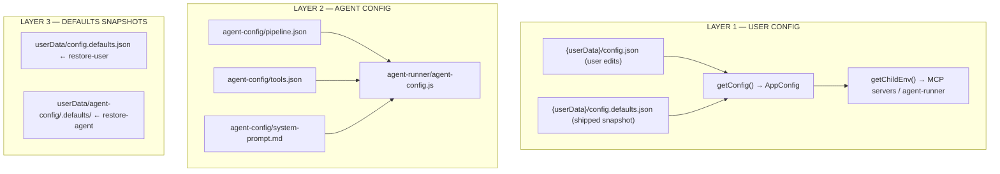
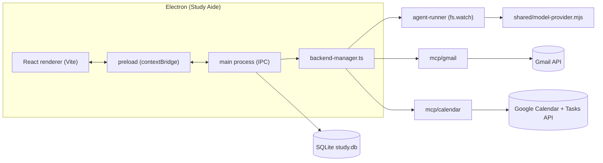
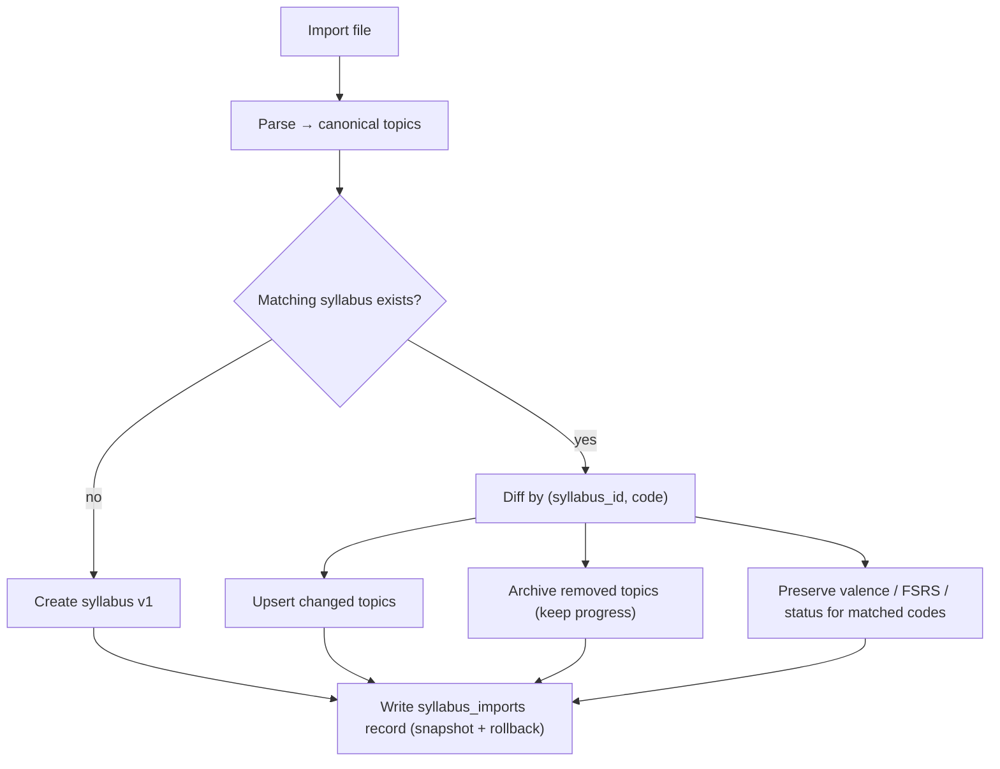
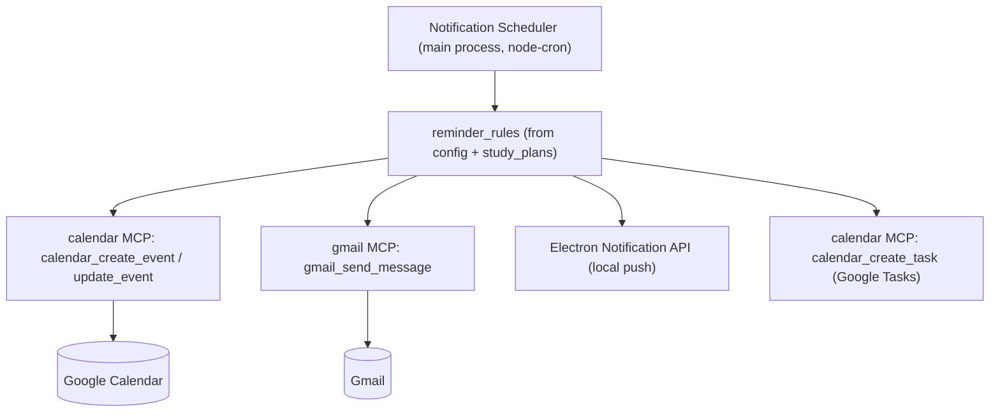

# Study Aide — Integrated Implementation Plan (v2)

> Supersedes `scaffold_notes/study_system.md`. Keeps the study philosophy (overlap-based
> interleaving, FSRS, valence tagging, Socratic dialogue, analog twin) and adds three
> integrated subsystems: **Gmail/Calendar MCP notifications**, a **first-class Syllabus
> system**, and an **Electron UI/config/LLM-provider foundation** derived from
> `ai_transcription_agent` + `copilot_agentic_task_helper`.

**Status:** phases 0–2 implemented · **Date:** 2026-09-10 (plan v2: 2026-09-09) · **Target:** A-level Math / Chemistry / Biology

> **Progress:** Phases 0 (foundation), 1 (data + syllabus) and 2 (FSRS +
> scheduling) are built and verified. See [`CHANGELOG.md`](CHANGELOG.md) for what
> shipped and [`development_environment.md`](development_environment.md) for local
> setup. Implementation notes and the deviations from this plan are at the end of
> §10.

---

## Table of Contents

1. [What carries over from v1](#1-what-carries-over-from-v1)
2. [Reference-derived foundations](#2-reference-derived-foundations)
3. [Syllabus subsystem](#3-syllabus-subsystem)
4. [Notification & reminder engine (Gmail + Calendar MCP)](#4-notification--reminder-engine)
5. [Integration matrix](#5-integration-matrix)
6. [Repository structure](#6-repository-structure)
7. [Data model](#7-data-model)
8. [UI & screens](#8-ui--screens)
9. [Config key reference](#9-config-key-reference)
10. [Revised execution plan](#10-revised-execution-plan)
11. [Security & privacy](#11-security--privacy)
12. [Open decisions](#12-open-decisions)

---

## 1. What carries over from v1

| v1 element | Verdict |
| :--- | :--- |
| Overlap-based interleaving (theme across A/B/C in one session) | **Keep** — becomes syllabus-driven (themes derive from syllabus topics) |
| FSRS spaced repetition | **Keep** — official `ts-fsrs` library in the Electron main process |
| Valence tagging (red/yellow/green) | **Keep** — attached to syllabus topics + flashcards |
| Two-mode LLM use (Mode A material generation, Mode B Socratic) | **Keep** — Mode A is now syllabus-grounded and batch/cached |
| Analog twin (paper system) | **Keep** — printables generated from the active syllabus |
| Notification engine (Email + iCal + Push) | **Replace** — now Gmail + Google Calendar **MCP servers** + Electron native push |
| iCal feed generation + Nodemailer/SMTP | **Drop** — Google APIs replace both |
| Electron + React + SQLite + FSRS app | **Keep** — rebuilt on the `ai_transcription_agent` shell |

---

## 2. Reference-derived foundations

### 2.1 Visual design system (from `ai_transcription_agent`)

**Theme tokens** applied to `:root` via `applyAppearance()` (mirrors `electron/src/renderer/appearance.ts`):

| Token | Dark (default) | Light |
| :--- | :--- | :--- |
| `--bg` | `#0d1117` | `#ffffff` |
| `--surface` | `#161b22` | `#f6f8fa` |
| `--surface-hover` | `#1c2333` | `#eaeef2` |
| `--border` | `#30363d` | `#d0d7de` |
| `--text` | `#e6edf3` | `#1f2328` |
| `--text-muted` | `#8b949e` | `#656d76` |

- `--accent` user-configurable; derived `--accent-hover` = accent + `cc`, `--accent-border` = accent + `44`.
- `APPEARANCE_THEME` = `system` \| `dark` \| `light`; `system` tracked via `matchMedia("(prefers-color-scheme: dark)")` listener.
- Font scale presets: `small 0.85` · `medium 1.0` · `large 1.15` · `x-large 1.35` · `xx-large 1.6`, exposed as `--fs-12 … --fs-28`.
- Layout shell: `.app` = flex column `100vh`; `.app-header` uses `-webkit-app-region: drag`; persistent bottom `StatusBar` (service health + job-in-progress pill).
- Styles split into `styles/_reset.css`, `_layout.css`, `_form-fields.css`, `_scrollbar-tooltips.css` + `styles/components/_<panel>.css` per panel.
- Icons via a thin `Icon.tsx` wrapper (Material Symbols). Tooltips via a shared `Tooltip.tsx`.

**Study Aide screen mapping:**

| ai_transcription_agent panel | Study Aide equivalent |
| :--- | :--- |
| `UploadPanel` | **Import Syllabus** / **Generate Materials** |
| `ProgressPanel` (stage stepper, gates) | **Generation pipeline stepper** (parse → topics → flashcards → review gate) |
| `ResultsViewer` (tabs) | **Session / Review view** (cards, overlays, notes) |
| `HistoryPanel` | **Study history** (sessions, quizzes, imports) |
| `ConfigPanel` | **Settings** (LLM, Google, notifications, FSRS, syllabus) |
| `AppearancePanel` | **Appearance** (theme, accent, font, sidebar width) |
| `DevPanel` | **Dev** (logs, LLM usage/cost, storage, updates) |
| `StoragePanel` | **Storage** (DB size, exports, backups) |
| `LicenseGate` / `GateReviewModal` | reused as **Review-before-save gate** for generated materials |

### 2.2 Config architecture (3 layers, from `ai_transcription_agent`)



**Merge priority (highest → lowest):** `config.json` (user) → `process.env` / `.env` → hardcoded `DEFAULTS`.
**Source annotation** in the Settings UI: `"user_config"` \| `"environment"` \| `"default"`.

IPC channels (adapt from `electron/src/main/index.ts` + `config.ts`):
`config:get`, `config:getWithSources`, `config:save`, `config:clear`, `config:check`,
`config:export`, `config:import`, `config:restore-defaults`,
`agent-config:get|save|restore-defaults`, `ui-state:get|save`.

- Live agent config files are **gitignored**; committed as `*.template.json` / `*.template.md`.
- `config.json` in the repo root is honored by every Node entry point through a shared
  `shared/config-loader.cjs` (copied pattern from `copilot_agentic_task_helper`) so MCP servers,
  the runner, and Electron all agree.

### 2.3 LLM provider layer (from `shared/model-provider.mjs`)

Single module `shared/model-provider.mjs`, fetch-based (Node 18+), used by **both** the
agent-runner and any in-app LLM call:

| Provider | `LLM_PROVIDER` | Key | Default model |
| :--- | :--- | :--- | :--- |
| DeepSeek (default) | `deepseek` | `DEEPSEEK_API_KEY` | `deepseek-v4-flash` |
| OpenAI | `openai` | `OPENAI_API_KEY` | `gpt-4o` |
| Anthropic | `anthropic` | `ANTHROPIC_API_KEY` | `claude-sonnet-4-5` |
| Ollama (local) | `ollama` | none (`OLLAMA_BASE_URL`) | `OLLAMA_MODEL` |

- Normalized return: `{ toolCall: {name, arguments} | null, reply: string | null, usage }`.
- `mapTools(toolDefs)` converts MCP schema defs → OpenAI function-calling.
- `keyGuard()` fails fast with an actionable message; `checkOllamaHealth()` probes `/api/tags`.
- Provider/model resolved **live from env on every call** so Settings changes apply without restart.
- `usage-tracker.mjs` records tokens/cost per call → surfaced in the Dev panel.

**Repurposed for Study Aide:**
- **Mode A (material generation)** — one batched call per syllabus section/topic.
- **Mode B (Socratic)** — multi-turn `callChatHistory()` with tool access.
- **Syllabus parsing** — one call to turn a PDF/pasted outline into structured topics.

### 2.4 Agent config (pipeline / tools / system prompt)

Adapt `agent-config/` so pipeline steps are editable without code:

- `pipeline.template.json` → study pipelines: `material-generation`, `socratic`, `weekly-review`.
- `tools.template.json` → allowlisted tools (`gmail_*`, `calendar_*`, `fsrs_*`, `syllabus_*`).
- `system-prompt.template.md` → Socratic fire-tender persona + syllabus grounding rules.
- `schema.json` validates: `name` `^[a-z_]+$`, `handler` `bridge|direct`, `terminal` boolean, `inputSchema`.
- Safety allowlist (from `mcp/agent-runner/tool-executor.js`): autonomous runs may only **read**
  (`gmail_list_messages`, `gmail_get_message`, `calendar_list_events`) — **send/create tools require
  the Review gate** (user confirms before email send or event creation).

### 2.5 Service architecture



- Renderer has **no** `nodeIntegration`; all access via `contextBridge` methods (see 2.2 IPC list).
- `backend-manager.ts` spawns the agent-runner and (on demand) the MCP servers, health-polls them,
  and restarts on crash. In packaged mode, child Node services run on Electron's embedded Node
  (`ELECTRON_RUN_AS_NODE=1`).
- `ui-state.json` persists panel tabs/subtabs/filters and in-progress drafts across restarts.
- Logger: in-memory ring buffer (last 50k entries) + per-session log files, streamed to the Dev panel.

### 2.6 MCP servers (Gmail + Calendar, from `copilot_agentic_task_helper`)

Adopt the two MCP servers **as-is in shape**, generalized:

```
mcp/
├── gmail/          index.js  (stdio MCP server)
├── calendar/       index.js  (stdio MCP server; also exposes Google Tasks)
└── lib/
    └── google-client.mjs     ← SHARED auth + API core (new; avoids duplication)
shared/
├── config-loader.cjs
├── model-provider.mjs
├── tool-manifest.js          (gmailTools, calendarTools — single source of truth)
├── logger.mjs
└── usage-tracker.mjs
scripts/
└── sanitize.stub.mjs
```

| Server | Tools |
| :--- | :--- |
| **gmail** | `gmail_list_messages`, `gmail_get_message`, `gmail_send_message` |
| **calendar** | `calendar_list_calendars`, `calendar_list_events`, `calendar_get_event`, `calendar_create_event`, `calendar_update_event`, `calendar_delete_event`, `calendar_list_tasklists`, `calendar_list_tasks`, `calendar_create_task`, `calendar_update_task` |

- Auth: one OAuth2 client (`GMAIL_CLIENT_ID` / `GMAIL_CLIENT_SECRET` / `GMAIL_REFRESH_TOKEN`)
  with **combined Gmail + Calendar + Tasks scopes**, created once by `scripts/gmail-auth.mjs`.
- **New:** extract the Google auth + API calls into `mcp/lib/google-client.mjs` so the servers and
  the in-app notification engine share one implementation.
- Friendly calendar names via `safe/calendars.json` (`resolveCalendarId`); default `primary`.
- All external payloads pass through `sanitizeObject()` (prompt-injection stripping) before logging.
- Tool calls log through `shared/logger.mjs`.

---

## 3. Syllabus subsystem

### 3.1 Requirements

| Requirement | Design |
| :--- | :--- |
| **Importable** | CSV, JSON, Markdown outline, pasted text, PDF (LLM-assisted extraction) |
| **Overwrite-able** | Re-import replaces topics; **user progress is preserved** by matching on `(syllabus_id, code)` |
| **Own section** | Dedicated **Syllabus** panel with tabs: Active · Imports · Coverage · Editor |
| **Referenced everywhere** | Single source of truth for materials generation, overlays, scheduling, analytics, notifications |

### 3.2 Import formats

| Format | Parser | Notes |
| :--- | :--- | :--- |
| **JSON** | direct | canonical: `{ subject, board, level, examDate, topics: [{code,title,section,parent,estHours}] }` |
| **CSV** | `papaparse` | columns: `code,title,section,parent,est_hours` |
| **Markdown** | heading-tree parser | `##` = section, `###` = topic |
| **Pasted text** | LLM (one call) | returns the canonical JSON shape |
| **PDF/DOCX** | text extract → LLM | extraction cached so re-import is deterministic |

### 3.3 Overwrite / merge semantics



- **Never hard-delete** topics with review history — set `archived_at`.
- `syllabus_imports` stores the raw import + a diff so any import can be **rolled back**.
- Only one syllabus per `(subject, board, level)` is `is_active` at a time; others are kept for reference.

### 3.4 Systems that consume the syllabus (the "any other systems?" answer)

| # | System | How it uses the syllabus |
| :-- | :--- | :--- |
| 1 | **Material generation** | Generates flashcards/quizzes per topic — topics come from the syllabus, never free-typed |
| 2 | **Overlay / theme map** | Themes (EQUILIBRIUM, EXPONENTIAL CHANGE, ENERGY) are **derived** by matching topic titles across the three subject syllabi; `overlap-map.json` is seeded from this, then hand-tuned |
| 3 | **Interleaved scheduler** | Picks the most-overdue topic per subject *that is still in the syllabus* and builds the A→B→C blocks |
| 4 | **FSRS** | New-card intake is capped by syllabus priority; due cards are grouped by syllabus topic |
| 5 | **Coverage analytics** | % of syllabus topics introduced / mastered; exam-readiness projection per subject |
| 6 | **Notifications** | Reminders name the syllabus topic; exam dates from the syllabus drive countdown + calendar events |
| 7 | **Calendar** | Exam dates → all-day events; weekly study blocks → recurring events; per-topic due tasks → Google Tasks |
| 8 | **Socratic dialogue** | System prompt is grounded in the current topic code/section so questions stay in scope |
| 9 | **Valence tagging** | Valence attaches to syllabus topics; topic → cards aggregate a topic-level valence |
| 10 | **Quiz generation** | Samples only topics already introduced in the syllabus (prevents uncontrolled scope creep) |
| 11 | **Session logger** | Records which topic codes were covered per session, enabling coverage + streak stats |
| 12 | **Analog twin printables** | Weekly plan, overlay cards, and theme cards are printed *from* the active syllabus |
| 13 | **Onboarding** | First-run wizard = import syllabus → set exam date → set daily target |

---

## 4. Notification & reminder engine

Replaces v1's iCal + SMTP with Google APIs via the MCP servers.



| Type | Channel | Trigger | Content |
| :--- | :--- | :--- | :--- |
| Daily schedule | Gmail + push | `DAILY_DIGEST_TIME` (08:00) | Today's plan + syllabus topic names |
| Pre-study reminder | Gmail + push | `REMINDER_OFFSETS` (e.g. `60,10` min) | "Session at 19:00 — Batch 2: Equilibrium (Chem) / Logs (Math) / Homeostasis (Bio)" |
| Study start | push | session start | "Your session starts now." |
| Pomodoro break | push | 20 min in | "5-minute break — walk, hydrate." |
| Session complete | push | session end | "Reviewed 12 cards · coverage +2 topics." |
| Weekly valence review | Gmail | `WEEKLY_REVIEW_DAY` | Valence + coverage digest for the week |
| Exam countdown | Calendar + Gmail | 30/14/7/1 days before exam date | Syllabus coverage vs. exam date |
| Overdue cards | push | 18:00 if backlog > threshold | "23 cards due — 6 are from Batch 1." |

**Config-driven reminder rules** (`notifications` table + config keys) so offsets/days are editable in
the Settings panel. All **sends** (email + event creation) pass through the Review gate by default
(`NOTIFY_AUTOSEND=false` on first run).

---

## 5. Integration matrix

| System | Syllabus | Gmail/Calendar MCP | LLM | Key config |
| :--- | :--: | :--: | :--: | :--- |
| Material generation | ✅ | — | ✅ (Mode A) | `LLM_PROVIDER`, `*_API_KEY` |
| Overlay map | ✅ | — | optional | `SYLLABUS_ACTIVE_ID` |
| Interleaved scheduler | ✅ | — | — | `DAILY_STUDY_TARGET` |
| FSRS | ✅ | — | — | `FSRS_DESIRED_RETENTION` |
| Notifications | ✅ | ✅ | — | `REMINDER_OFFSETS`, `DAILY_DIGEST_TIME` |
| Calendar sync | ✅ | ✅ | — | `GOOGLE_CALENDAR_ID` |
| Socratic | ✅ | — | ✅ (Mode B) | `LLM_PROVIDER`, `LLM_TEMPERATURE` |
| Valence | ✅ | — | — | — |
| Analytics | ✅ | — | optional | `EXAM_DATE` |
| Analog printables | ✅ | — | — | — |

---

## 6. Repository structure

```
study_aide_agent/
├── docs/
│   ├── study_aide_implementation_plan.md   ← this file
│   ├── system_overview.md
│   ├── configuration_guide.md
│   ├── syllabus_subsystem.md
│   ├── notifications_integrations.md
│   └── ui_design_system.md
├── electron/
│   ├── src/
│   │   ├── main/
│   │   │   ├── index.ts            # windows, tray, IPC handlers
│   │   │   ├── preload.ts          # contextBridge
│   │   │   ├── backend-manager.ts  # spawns runner + MCP servers
│   │   │   ├── config.ts           # 3-layer config + getChildEnv()
│   │   │   ├── notifications.ts    # scheduler → MCP tools
│   │   │   ├── logger.ts
│   │   │   ├── ui-state.ts
│   │   │   └── auto-updater.ts
│   │   └── renderer/
│   │       ├── App.tsx
│   │       ├── appearance.ts       # CSS custom properties
│   │       ├── components/         # Dashboard, Syllabus, Review, Session, Socratic, Analytics, Settings…
│   │       ├── hooks/
│   │       └── styles/
│   │           ├── _reset.css  _layout.css  _form-fields.css  _scrollbar-tooltips.css
│   │           └── components/_*.css
├── agent-runner/                   # fs.watch → LLM pipeline
├── mcp/
│   ├── gmail/index.js
│   ├── calendar/index.js
│   └── lib/google-client.mjs
├── services/
│   ├── database/  fsrs/  scheduling/  flashcard/  socratic/  analytics/  syllabus/
├── shared/
│   ├── config-loader.cjs
│   ├── model-provider.mjs
│   ├── tool-manifest.js
│   ├── logger.mjs
│   └── usage-tracker.mjs
├── agent-config/
│   ├── pipeline.template.json
│   ├── tools.template.json
│   ├── system-prompt.template.md
│   └── schema.json
├── scripts/
│   ├── gmail-auth.mjs
│   └── sanitize.stub.mjs
├── data/                           # overlap-map.json, socratic-trees.json (seeded, committed)
├── tokens/                         # gitignored (OAuth token cache)
├── safe/                           # gitignored (gmail-oauth2.json, calendars.json)
├── .env.example
├── .gitignore
├── package.json
└── tsconfig.json
```

---

## 7. Data model (SQLite)

Extends v1; **new** tables marked ★.

| Table | Purpose | Key fields |
| :--- | :--- | :--- |
| **users** | settings | id, name, timezone, study_goal, daily_study_target, exam_date |
| ★ **syllabus** | imported syllabi | id, subject, board, level, exam_date, source_file, is_active, imported_at |
| ★ **syllabus_topics** | topics | id, syllabus_id, parent_id, code, title, section, order_index, est_hours, status, valence, archived_at |
| ★ **syllabus_imports** | import history/rollback | id, syllabus_id, raw_payload, diff_json, created_at |
| **flashcards** | card data | id, topic_id→syllabus_topics, question, answer, valence, difficulty, stability, last_review, next_review, review_count |
| **overlay_connections** | cross-subject links | id, theme, subject_a/concept_a, subject_b/concept_b, subject_c/concept_c, description, source (derived\|manual) |
| **study_sessions** | recorded sessions | id, session_date, duration, session_type, themes, topic_codes, score |
| **quiz_results** | performance | id, flashcard_id, session_id, correct, confidence, response_time_ms |
| **valence_tags** | valence | target_type (topic\|flashcard), target_id, tag, intensity 1-5, created_at |
| **study_plans** | generated plans | id, date, plan_json, completed |
| **notifications** | reminders | id, type, channel, scheduled_at, sent_at, message, context_json, gmail_message_id, calendar_event_id |
| ★ **notification_rules** | reminder config | id, type, channel, offset_minutes, enabled |
| ★ **llm_usage** | token/cost log | id, provider, model, prompt_tokens, completion_tokens, cost, context, created_at |
| ★ **generation_jobs** | material-gen runs | id, pipeline, input_json, output_json, status, gate_state, created_at |

> **Note:** v1's `topics` table is superseded by `syllabus_topics`. Keeping topics inside a
> syllabus gives every downstream system a stable `code` to reference.

---

## 8. UI & screens

| Screen | Draws from (reference panel) | Content |
| :--- | :--- | :--- |
| **Onboarding** | `UploadPanel` + `ConfigPanel` | Import syllabus → exam date → daily target → connect Google |
| **Dashboard** | `App.tsx` shell + `StatusBar` | Today's plan, due cards, streak, coverage %, Start session, sync status |
| **Syllabus** (own section) | `HistoryPanel` + `ResultsViewer` tabs | Sub-tabs: **Active** · **Imports** · **Coverage** · **Editor**; drag-drop import; diff preview before overwrite |
| **Generate** | `ProgressPanel` stepper + `GateReviewModal` | Choose syllabus topics → pipeline stepper → review gate → save |
| **Review** | `ResultsViewer` | Card front/back, rate Again/Hard/Good/Easy, valence tag |
| **Session** | `ProgressPanel` | Timeblock timer, subject + overlays, notes, auto-log |
| **Socratic** | `RichTextView`/`RichTextEditor` chat | Multi-turn chat, pre-written trees, save to notes |
| **Analytics** | `HistoryPanel` charts | Coverage over time, retention, valence trends, exam-readiness |
| **Notifications** | `_notifications.css` | Toggle channels, reminder offsets, digest time, test-send |
| **Settings** | `ConfigPanel` | LLM provider, Google creds, FSRS, syllabus, notifications, source annotations |
| **Appearance** | `AppearancePanel` | Theme, accent color, font size, sidebar width |
| **Dev** | `DevPanel` | Logs, LLM usage/cost, storage, updates |

---

## 9. Config key reference

```jsonc
{
  // ── LLM ──
  "LLM_PROVIDER": "deepseek",            // deepseek | openai | anthropic | ollama
  "DEEPSEEK_API_KEY": "",
  "DEEPSEEK_MODEL": "deepseek-v4-flash",
  "OPENAI_API_KEY": "", "OPENAI_MODEL": "gpt-4o", "OPENAI_BASE_URL": "",
  "ANTHROPIC_API_KEY": "", "ANTHROPIC_MODEL": "claude-sonnet-4-5", "ANTHROPIC_MAX_TOKENS": "4096",
  "OLLAMA_BASE_URL": "http://127.0.0.1:11434", "OLLAMA_MODEL": "", "OLLAMA_NUM_CTX": "32768",
  "LLM_TEMPERATURE": "0.1",

  // ── Google (Gmail + Calendar + Tasks, one OAuth token) ──
  "GMAIL_CLIENT_ID": "", "GMAIL_CLIENT_SECRET": "", "GMAIL_REFRESH_TOKEN": "",
  "GMAIL_USER": "me", "GOOGLE_CALENDAR_ID": "primary",

  // ── Notifications ──
  "NOTIFY_CHANNELS": "email,calendar,push",
  "NOTIFY_AUTOSEND": "false",            // require review gate before send
  "REMINDER_OFFSETS": "1440,60,10",      // minutes before session
  "DAILY_DIGEST_TIME": "08:00",
  "WEEKLY_REVIEW_DAY": "saturday",

  // ── Study ──
  "DAILY_STUDY_TARGET": "90",            // minutes
  "SESSION_LENGTH": "20", "BREAK_LENGTH": "5",
  "TIMEZONE": "America/Jamaica",
  "EXAM_DATE": "",

  // ── FSRS ──
  "FSRS_DESIRED_RETENTION": "0.9", "FSRS_MAX_INTERVAL": "365", "NEW_CARDS_PER_DAY": "20",

  // ── Syllabus ──
  "SYLLABUS_ACTIVE_ID": "",
  "SYLLABUS_IMPORT_FORMAT": "auto",      // auto | csv | json | md | pdf

  // ── Appearance ──
  "APPEARANCE_THEME": "system",          // system | dark | light
  "APPEARANCE_ACCENT_COLOR": "#2f81f7",
  "APPEARANCE_FONT_SIZE": "medium",      // small | medium | large | x-large | xx-large
  "APPEARANCE_SIDEBAR_WIDTH": "260",

  // ── Ops ──
  "LOG_LEVEL": "info", "USAGE_TRACKING_ENABLED": "true"
}
```

---

## 10. Revised execution plan

### Phase 0 — Foundation (Days 1–3) ✅ **complete**
- Scaffold Electron + React + Vite on the `ai_transcription_agent` shell (`App.tsx`, appearance, styles).
- `config.ts` 3-layer config + `getChildEnv()`; `preload.ts` contextBridge; `ui-state.ts`.
- `.gitignore` + `agent-config/*.template.*` + `shared/config-loader.cjs`.

Implemented as planned, plus four working panels (Appearance, Configuration,
Developer, Storage) rather than placeholders, so the config and logging plumbing
is exercised end to end. The screenshot/guide/tray features are deferred to
phase 7.

### Phase 1 — Data & syllabus (Days 4–8) ✅ **complete**
- SQLite schema (§7) + migrations; `services/database/`.
- `services/syllabus/`: parsers (JSON/CSV/MD/paste/PDF), canonical schema, diff/merge/overwrite, rollback.
- **Syllabus panel** (`Active` / `Imports` / `Coverage` / `Editor`) with import + diff preview.

All three deliverables landed, with coverage analytics computed from topic status
and valence (so it works before FSRS review data exists). DOCX joined the parser
set alongside PDF.

### Phase 2 — FSRS & scheduling (Days 9–12) ✅ **complete**
- `ts-fsrs` integration; review view with ratings; valence tagging.
- Interleaved scheduler driven by syllabus topics + overlay map.
- **Dashboard** + **Session** views.

All three deliverables landed, dispatched as 2A (schema + FSRS service), 2B
(overlay themes), 2C (plan builder + session lifecycle), 2D (IPC), 2E (the three
panels) and 2F (the phase 0–1 audit backlog), which the user asked to absorb into
this phase.

Notable refinements to the plan above:
- The scheduler is **hybrid** rather than purely theme- or purely overdue-driven,
  because each model fails on its own (see `services/scheduler/plan.ts`).
- `resolveTheme` takes a **set** of syllabus ids and matches per subject as well
  as per code — the plan's single-id signature could never report a theme
  spanning three subjects, since each subject is its own `syllabus` row.
- A new `STUDY_START_TIME` config key anchors the plan's times; the plan had no
  such key, though §8's onboarding implies one.
- `overlay_connections` is superseded by `overlay_themes` +
  `overlay_theme_topics` and is no longer written.
- Cards are authored by hand until phase 3 supplies generation.
- The StatusBar activity pill was deferred; the Session panel carries the clock.

### Phase 3 — LLM provider & generation (Days 13–17)
- `shared/model-provider.mjs` + `usage-tracker.mjs` adapted.
- `agent-runner/` + `agent-config/pipeline` for `material-generation`; review gate before save.
- **Generate** panel (syllabus-grounded flashcards/quizzes).

### Phase 4 — Gmail + Calendar MCP (Days 18–22)
- `mcp/lib/google-client.mjs` (shared auth/API core) + `mcp/gmail` + `mcp/calendar`.
- `shared/tool-manifest.js`, `shared/logger.mjs`, `scripts/sanitize.stub.mjs`, `scripts/gmail-auth.mjs`.
- Settings → **Google** section (connect, test, source annotations).

### Phase 5 — Notifications (Days 23–26)
- `electron/src/main/notifications.ts`: node-cron scheduler, `notification_rules`, Review gate.
- Calendar events (study blocks + exam dates) + Google Tasks for daily items + Gmail digest.
- Electron native push; **Notifications** panel.

### Phase 6 — Socratic & analytics (Days 27–31)
- `callChatHistory()` chat + pre-written trees in `data/socratic-trees.json`.
- Analytics: coverage, retention, valence trends, exam-readiness.
- Analog printables (weekly plan, overlay cards) export.

### Phase 7 — Polish & package (Days 32–36)
- Storage panel, Dev panel (logs/usage), auto-updater, restore-defaults.
- End-to-end test with a real syllabus; package `.dmg` / `.exe` / `AppImage`.

### Implementation notes — deviations from this plan

Written up in full in [`CHANGELOG.md`](CHANGELOG.md); the structural ones:

| Plan says | As built | Why |
| :--- | :--- | :--- |
| `services/` at the repo root | `electron/services/` | The main process is compiled by `tsc` with `rootDir: src/main`; a root-level `services/` either breaks that or forces a convoluted output path. |
| — (unspecified) | Main entry is `dist/src/main/index.js` | Follows from `rootDir: "."` / `outDir: "dist"` so `services/` can be imported by the main process. |
| Migrations unspecified | TypeScript modules exporting SQL strings, not `.sql` files | `tsc` does not copy non-TS assets into `dist`, so `.sql` files would be missing in a packaged build. |
| `syllabus_imports` stores `raw_payload` + `diff_json` | Also stores `prior_snapshot_json` | Raw + diff alone cannot undo an import — you need the pre-import state. |
| `usage-tracker.mjs` records tokens/cost per call | Retargeted to a sink hook writing the local `llm_usage` table | The reference implementation pushes to an external telemetry service; a local-first app should not. |
| `ts-fsrs` (phase 2) | Driver choice made now: `node:sqlite` | Electron 43 bundles Node 24.20, so the built-in module is available with no native rebuild and no ABI/notarisation risk. |
| SQLite driver in the main process | `services/database/db.ts` is a thin facade | Keeps a swap to `better-sqlite3` a one-file change if `node:sqlite` proves limiting. |

Two smaller decisions: no tray icon (would require shipping an asset; deferred to
phase 7) and the Appearance/Configuration/Developer/Storage panels were built for
real in phase 0 rather than stubbed, since they are what makes the config and
logging layers verifiable.

---

## 11. Security & privacy

- **Local-first:** SQLite + local audio/notes; only LLM/Google calls leave the machine.
- **Secrets:** `safe/gmail-oauth2.json`, `tokens/`, `.env`, `config.json` are **gitignored**; never logged.
- **OAuth scopes:** minimal combined Gmail (`gmail.send`, `gmail.readonly`), Calendar (`calendar.events`), Tasks.
- **Prompt-injection:** all external data (email bodies, event descriptions, imported syllabus) passes
  through `sanitizeObject()` before reaching the LLM.
- **Tool allowlist:** autonomous runs are read-only; `gmail_send_message` / `calendar_create_event`
  require the Review gate unless `NOTIFY_AUTOSEND=true`.
- **No `nodeIntegration`;** renderer talks through `preload.ts` only.

---

## 12. Open decisions

1. **Syllabus storage:** DB-only vs. DB + committed JSON snapshot for portability?
2. **LLM default:** DeepSeek (cheapest) vs. Ollama (fully local) as the shipped default?
3. **Overlay map:** fully derived from syllabus matching, or seeded + hand-edited (`data/overlap-map.json`)?
4. **Google Tasks:** use for daily plan items, or keep plans DB-only?
5. **iCal export:** keep as an optional offline fallback alongside the Calendar API?
6. **Multi-syllabus:** support studying two exam boards simultaneously, or one active at a time?
